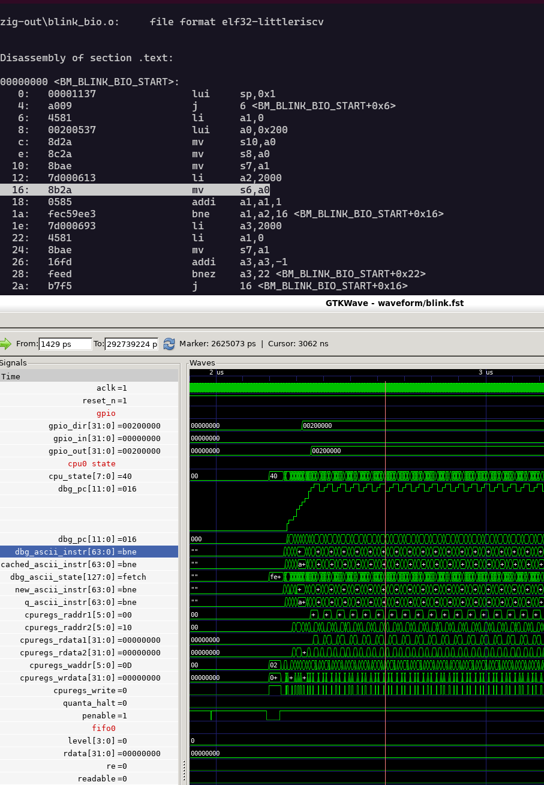

# bio-sim

A Verilator harness for the `bio_bdma` block. The host CPU is not modelled;
everything it would do (load code, poke control registers, start cores) is
reduced to APB transactions on the block's slave ports, driven from C++. The
original ASIC RTL is used unmodified and built with `+define+SIM`.

## Development Loop

The basic development loop is:

1. Write BIO program in sw/\<my-prog\>/main.c
2. Build code with `python3 -m ziglang build "-Dmodule=<my-prog>"` inside `sw/`. See [Building](./README.md#building) for more.
3. Configure simulation environment with jsonc file in configs/\<my-prog\>.jsonc See [Config syntax](./README.md#jsonc-config-file-grammar) for more.
4. Simulate with `./container-run configs/<my-prog>.jsonc` (see [containers](./README.md#build--run-with-containers)) or `./simulate configs/<my-prog>.jsonc` (see [locally built](./README.md#build--run-locally---requires-a-compatible-local-verilator-install) verilator)
5. (Optional) View waveforms with `python3 ./biowave.py <my-prog>`: requires a custom-built `gtkwave`
6. Repeat steps 1, 2 & 4, and reload waveform in 5.
7. Load your code onto actual hardware. For `Dabao`, see [bio-loader](https://github.com/baochip/bio-loader); requires the latest `dabao-console` version.

## Build & run with containers

The instructions here default to using `podman` but they *should* work identically with
`docker`. `podman` is preferred here as nothing in this repo requires root privileges.

Build the container locally: `podman build -t bio-sim .`

**or**

Install the container:
  - from GHCR: `podman pull ghcr.io/baochip/bio-sim:latest`
  - from Baochip self-hosted: `curl -fsSL https://baochip.com/cdn/bio-sim-latest-x86_64.tar.gz | podman load`

Run the container: `./container-run configs/smoke.json`

- `--rebuild` will rebuild the container
- `--port` defines the port for connecting to clients

### Maintainance Note

To build a containe for the baochip CDN, run:

`podman save bio-sim:latest | gzip > bio-sim-latest.tar.gz`

## Build & run locally - requires a compatible local Verilator install

```bash
make build                     # fetches json.hpp, runs verilator, compiles
make run CONFIG=configs/smoke.json
# or:
./simulate configs/smoke.json
```

`make build` depends on the single-header `nlohmann/json` into `sim/json.hpp`
(one-time, needs network). If the build host is offline, fetch it manually:
```bash
curl -fsSL https://raw.githubusercontent.com/nlohmann/json/v3.11.3/single_include/nlohmann/json.hpp -o sim/json.hpp
```

## Directory layout

```
bio-sim/
├── rtl/                  # bio-bdma RTL tree, taken from baochip-1x repo
│   ├── bio_bdma.sv
│   ├── bio_bdma_wrapper.sv   # <-- DUT (flattened Verilog ports)
│   ├── picorv32.v ...
│   └── lib/
│       ├── template.sv   # Various libs and configs
│       └── ...
├── sim/
│   └── sim_main.cpp      # the harness (clocks, APB transactor, loader, trace)
├── configs/
│   ├── smoke.jsonc       # no firmware; just the cfginfo self-test
│   └── hello-world.jsonc # example of toggle-a-pin
├── rtl.f                 # Verilator file list
├── Makefile
├── Dockerfile
├── simulate              # Local build & run (not containerized)
├── container-run         # Runs the simulation from a container
├── clients/              # Simulation clients (real-time interaction with simulator)
├── gtkw/                 # GTKW "views"
│   └── bio.gtkw          # A starter view
├── waveform/             # Simulation output directory for `.fst` files
├── sw/
│   ├── build.zig         # Script for building BIO binaries from C code
│   ├── clang2rustasm.py  # Script that creates Rust assembly and patches BIO erratum
│   ├── include/          # Header files with starter libraries
│   │   ├── bio.h         # This is the only .h file you must include in every program
│   │   └── ...
│   ├── blink/
│   │   ├── blink.bin     # Generated artifact, only available after running the build command
│   │   ├── blink.rs      # A Rust macro suitable for including in Xous builds
│   │   └── main.c        # The C source for the `blink` demo
│   └── ...
├── docs/                 # Documentation-related files
└── README.md
```

The containerized version contains a pre-build of the BIO model as an
executable.

## Smoke Test

`configs/smoke.json` runs no firmware. After reset the harness reads
`sfr_cfginfo` at offset `0x04` over the main APB port and checks it equals
`0x10000408` (the register hardwires `{16'd4096, 8'd4, 8'd8}`). A `PASS`
confirms that the build resolved, the clocking/reset are sane, and the APB transactor
completes a real transaction.

Example of successful smoke test run:

```
./container-run configs/smoke.jsonc
>> reusing image 'bio-sim'  (use --rebuild after editing rtl/ or sim/)
[trace] writing waveform/trace.fst
[cfg] fclk=700.000 MHz  pclk=fclk/16 (43.750 MHz)
Addressing configuration for axil_crossbar_addr instance TOP.bio_bdma_wrapper.bio_bdma.axil_demux.axil_crossbar_wr_inst.s_ifaces[0].addr_inst
 0 ( 0): 40000000 / 29 -- 40000000-5fffffff
 1 ( 0): 60000000 / 29 -- 60000000-7fffffff
Addressing configuration for axil_crossbar_addr instance TOP.bio_bdma_wrapper.bio_bdma.axil_demux.axil_crossbar_rd_inst.s_ifaces[0].addr_inst
 0 ( 0): 40000000 / 29 -- 40000000-5fffffff
 1 ( 0): 60000000 / 29 -- 60000000-7fffffff
[selftest] sfr_cfginfo @0x04 = 0x10000408 (expect 0x10000408) -> PASS
[run] up to 0 cycles
[done] sim_time = 902496 ps  (0 cycles)
```

## The `blink` demo

The `blink` demo is a simple program that toggles a GPIO on and off. This section walks through all the stages of building, simulating, and viewing waveforms.

### Building

#### Prerequisites

The C build system relies on Zig. You can get this via Python's `pip`, requiring Python >= 3.9:

`python3 -m pip install ziglang`

#### Build

Change to the `sw` directory, and run the build script:

```
cd sw
python3 -m ziglang build "-Dmodule=blink"
```

Example output:

```
Label mapping:
  _start               -> 20: (line 0)
  main                 -> 21: (line 6)
  .LBB1_1              -> 22: (line 20)
  .LBB1_3              -> 23: (line 29)

Wrote blink\blink.rs
  input:  zig-out\blink.s
  fn:     blink_bio_code()
  labels: BM_BLINK_BIO_START / BM_BLINK_BIO_END
  instructions: 21
  functions found: 2 (_start, main)
  binary: blink\blink.bin (44 bytes / 11 words)
  listing: blink\blink.dis (via riscv-none-elf-objdump)
```

### Simulating

Change back to the root directory, and run the simulation command:

`./container-run configs/blink.jsonc`

Example output:

```
>> reusing image 'bio-sim'  (use --rebuild after editing rtl/ or sim/)
>> reusing image 'bio-sim'  (use --rebuild after editing rtl/ or sim/)
[run] [##############################] 100%  100000/100000 cyc  139256 cyc/s  ETA 0s
[trace] writing waveform/blink.fst
[cfg] fclk=350.000 MHz  pclk=fclk/8 (43.750 MHz)
Addressing configuration for axil_crossbar_addr instance TOP.bio_bdma_wrapper.bio_bdma.axil_demux.axil_crossbar_wr_inst.s_ifaces[0].addr_inst
 0 ( 0): 40000000 / 29 -- 40000000-5fffffff
 1 ( 0): 60000000 / 29 -- 60000000-7fffffff
Addressing configuration for axil_crossbar_addr instance TOP.bio_bdma_wrapper.bio_bdma.axil_demux.axil_crossbar_rd_inst.s_ifaces[0].addr_inst
 0 ( 0): 40000000 / 29 -- 40000000-5fffffff
 1 ( 0): 60000000 / 29 -- 60000000-7fffffff
[selftest] sfr_cfginfo @0x04 = 0x10000408 (expect 0x10000408) -> PASS
[mon] watching gpio_out bit 21
[mon] watching gpio_dir bit 21
[mon] watching irq
[load] sw/blink/blink.bin -> core 0 (11 words)
[poke] sfr @0x008 <= 0x00000000
[poke] sfr @0x050 <= 0x00010000
[poke] sfr @0x06c <= 0x00000000
[start] sfr_ctrl @0x00 <= 0x111 (en=0x1 restart=0x1 clkdiv=0x1)
[run] up to 100000 cycles (stop on trap)
[mon] cyc=47 (2317838 ps)  gpio_dir[21]: 0 -> 1
[mon] cyc=59 (2352134 ps)  gpio_out[21]: 0 -> 1
[mon] cyc=33551 (99535566 ps)  gpio_out[21]: 1 -> 0
[mon] cyc=67004 (196698992 ps)  gpio_out[21]: 0 -> 1
[done] sim_time = 292739224 ps  (100000 cycles)
```

This example causes GPIO 21 to wiggle up and down, which you can see with the 0->1, 1->0 transition in the monitor output.

### Viewing Waveforms

#### Web-Based `surfer` Viewer

You can view the `blink.fst` waveform using the web-based [surfer](https://surfer-project.org/) viewer. Click the "three-bar menu" and do `File->Open` or type `ctrl-o` and upload `waveform/blink.fst`. Then, do `File->Load State...` and upload [`surfer/bio.surf.ron`](./surfer/bio.surf.ron) to display some starter waveforms.

We do not currently have a `surfer` extension that supports code zooming.

#### Code Zoom with `gtkwave`

A custom-built `gtkwave` enables you to hover-zoom over the `dbg_pc` trace and correlate waveform position to assembly code in real time. Build our fork [from source](https://github.com/baochip/gtkwave), or you can try one of our [releases](https://github.com/baochip/gtkwave/releases) if you're on Linux or Windows.

Start the viewer with `python3 ./biowave.py blink`; if you need to specify a path to the stand-alone binaries in the releases, use `python3 ./biowave.py blink --gtkwave-bin /path/to/gtkwave-x86_64.AppImage` (or `/path/to/gtkwave/bin/gtkwave.exe` for Windows).

This will cause the terminal to run the `codezoom.py` script, and pop open the `gtkwave` viewer, like this:



Left-clicking on the `dbg_pc` trace will cause the terminal to highlight the line of assembly code that corresponds to the current cursor position. Right-click drag will allow you to zoom in. Right click on a signal name and select "Open Scope" to find the location in the RTL hierarchy that corresponds to that signal.

From there, you can search for more signals to view, and drag them into the waveform viewer if you need additional visibility into the machine state.

### The `test-ws2812` demo

This demo works identically to `blink`, just replace `blink` with `test-ws2812`. This is a slightly more complicated program that simulates driving a WS2812 LED chain.

### The `interactive` demo

Build the `invert` program:

```
cd sw
python3 -m ziglang build "-Dmodule=invert"
```

Start the `server` demo:

`./container-run configs/server-demo.jsonc`

This will result in an output that looks like this:

```
>> reusing image 'bio-sim'  (use --rebuild after editing rtl/ or sim/)
>> auto-publishing serve port 5555 (from configs/server-demo.jsonc; override with --port)
[trace] writing waveform/serve.fst
[cfg] fclk=700.000 MHz  pclk=fclk/16 (43.750 MHz)
Addressing configuration for axil_crossbar_addr instance TOP.bio_bdma_wrapper.bio_bdma.axil_demux.axil_crossbar_wr_inst.s_ifaces[0].addr_inst
 0 ( 0): 40000000 / 29 -- 40000000-5fffffff
 1 ( 0): 60000000 / 29 -- 60000000-7fffffff
Addressing configuration for axil_crossbar_addr instance TOP.bio_bdma_wrapper.bio_bdma.axil_demux.axil_crossbar_rd_inst.s_ifaces[0].addr_inst
 0 ( 0): 40000000 / 29 -- 40000000-5fffffff
 1 ( 0): 60000000 / 29 -- 60000000-7fffffff
[selftest] sfr_cfginfo @0x04 = 0x10000408 (expect 0x10000408) -> PASS
[load] sw/invert/invert.bin -> core 0 (9 words)
[clock] core 0 <= 10000000 Hz (frac)  div_int=70 div_frac=0  (qdiv=0x00460000)  actual=10000000 Hz (+0 ppm)
[mon] watching gpio_out bit 1
[mon] watching gpio_out bit 2
[start] sfr_ctrl @0x00 <= 0x111 (en=0x1 restart=0x1 clkdiv=0x1)
[serve] listening on 0.0.0.0:5555  (fclk=700000000 Hz)
```

At this point, the simulation is paused, waiting for a client to join.

In another terminal, run the client program:

`python3 clients/interactive.py`

This will start an interaction that looks like the below. Use the space bar to toggle the pin, and control-C to exit the interaction:

```
connected to 127.0.0.1:5555, driving gpio_in[0]
SPACE = toggle pin,  Ctrl-C = exit
   <- # bio-sim ready
   <- output: evt 87 gpio_out 1 1
-> set gpio_in[0] = 1
   <- output: evt 216486 gpio_out 1 0
-> set gpio_in[0] = 0
   <- output: evt 414219 gpio_out 1 1
-> set gpio_in[0] = 1
   <- output: evt 562902 gpio_out 1 0
```

You'll see the server responding with:

```
[mon] cyc=87 (2123436 ps)  gpio_out[1]: 0 -> 1
[mon] cyc=216486 (311141208 ps)  gpio_out[1]: 1 -> 0
[mon] cyc=414219 (593503932 ps)  gpio_out[1]: 0 -> 1
```

What's happening here is the space bar is injection simulation events into verilator, in "wall-clock time", and responding to it at the rate that the server can simulate (in this demo, it's running at about 10kHz).

This mode is useful for stimulating truly asynchronous test cases.

# .jsonc config file grammar

Config files in `configs/` are **JSONC** - standard JSON plus `//` line and `/* */` block comments (parsed with `ignore_comments=true`). The harness (`sim/sim_main.cpp`) reduces every config to an **ordered command list** run against the DUT. After reset it always runs a `sfr_cfginfo` self-test before executing commands.

**Number format:** any numeric field accepts a JSON number *or* a string parsed base-0, so `41`, `"0x29"`, `"0o51"` are all valid.

---

## Top-level keys

| Key | Meaning |
|---|---|
| `fclk_mhz` | Fast clock in MHz. Default `700`. |
| `trace` | `{ file }` - enable FST waveform output. `file` default `"trace.fst"`. (A `format` field is accepted but ignored; output is always FST.) |
| `sw` | Shorthand name `<n>`: auto-loads `sw/<n>/<n>.bin` and traces to `<n>.fst` (unless `trace` is given). |
| `load_core` | Core for the auto-load. Default `0`. |
| `commands` | Explicit ordered array of command objects (modern schema, below). |

If `commands` is absent, the **legacy flat keys** are desugared into commands in this order: `monitor` → `load` (from `firmware`/`sw`) → `poke` (from `registers`) → `start` → `run`. With `commands` present, an `sw`/`firmware` load is prepended unless the array already contains a `load`.

Legacy flat keys: `firmware` (path string → `load`), `registers` (array → `poke` each), `start` (object → `start`), `monitor` (array → `monitor` each), `run` (object → `run`).

---

## Commands

Each entry in `commands` is an object with a `cmd` field. Unknown `cmd` values are warned and skipped.

**Firmware & registers**
- `load {core?, bin}` - load a `.bin` into a core's IMEM. `core` default `0`; bytes zero-padded to a word.
- `poke {name|offset, value, port?}` - APB register write. Give register `name` (from the SFR map) and/or raw `offset`. `port` default `"sfr"`.
- `peek {name|offset, port?}` - APB register read, logged.

**FIFOs**
- `fifo_write {bank, data:[…]|value, via?}` - push word(s) to a TX FIFO `bank`. `via` is `"sfr"` (default, main port) or `"alias"` (per-bank page).
- `fifo_read {bank, count?, via?}` - pop word(s) from an RX FIFO. `count` default `1`.
- `fifo_drain {bank, max?, via?}` - pop all available words (or up to `max`); prints each as hex and signed-16.

**Cores & clocking**
- `start {cores:[…], restart?, clkdiv_restart?}` - enable the listed cores via `sfr_ctrl`. `restart` and `clkdiv_restart` default `true`.
- `clock {core, style?, …}` - set a core's clock divider. `core` is `0..3`. `style`:
  - `"frac"` (default) / `"int"` - needs `freq_hz` (target Hz; `int` forbids the fractional part).
  - `"fixed"` - needs `div_int`, optional `div_frac` (eighths of /256).
  - `"external"` - needs `pin` (drive the core clock from a GPIO).

**IO / events / interrupts**
- `io_config {mode?, i_inv?, o_inv?, oe_inv?, sync_bypass?, snap_inputs?, snap_outputs?}` - only the fields you name are written. `mode` is `"overwrite"` (default), `"set"`, or `"clear"`. `snap_*` take a core index `0..3`. (`mapped` is accepted but ignored - it targets the external IOX mux, not this DUT.)
- `fifo_event {fifo, slot?, level, less_than?, greater_than?, equal_to?}` - FIFO level-crossing trigger. `fifo` `0..3`, `slot` `0..1` (default `0`); comparison flags default `false`.
- `irq {which, mask, edge_triggered?}` - set IRQ line `which` (`0..3`) to a raw 32-bit `mask`. `edge_triggered` default `false` (else level).

**Stimulus & run control**
- `inject {events:[{cycle, pin, value}, …]}` - schedule timestamped `gpio_in` edges (driven-mode style).
- `monitor {signal, bit?}` - watch a top-level signal for edges; omit `bit` to watch the whole bus.
- `serve {port?, mode?, wait_for_client?, max_cycles?, min_dwell?}` - open a TCP server for live socket interaction. `port` default `5555`; `wait_for_client` default `true`. `mode` is `"realtime"` (default; `max_cycles` default `0`=unbounded, `min_dwell` default `2000`) or `"driven"` (lock-step, deterministic; `max_cycles`/`min_dwell` ignored).
- `run {cycles?|max_cycles?, stop_on_trap?}` - advance N fclk cycles (default `1000000`). `stop_on_trap` default `true`.
- `delay {cycles?}` - same as `run` but never stops on trap.

---

## Register reference (poke / peek)

`name` resolves against the SFR map; common entries: `sfr_ctrl` `0x00`, `sfr_cfginfo` `0x04` (RO), `sfr_config` `0x08`, `sfr_flevel` `0x0C` (RO), `sfr_txf0..3` `0x10..0x1C`, `sfr_rxf0..3` `0x20..0x2C` (RO), `sfr_qdiv0..3` `0x50..0x5C`, `sfr_extclock` `0x44`, `sfr_irqmask_0..3` `0x70..0x7C`. Writing a read-only register warns and is ignored by the RTL; a `name`/`offset` mismatch is an error.

---

## Example

```jsonc
{
  "fclk_mhz": 350,
  "firmware": "sw/blink/blink.bin",
  "load_core": 0,
  "registers": [
    { "name": "sfr_config", "value": "0x000" },
    { "name": "sfr_qdiv0",  "value": "0x00010000" },
    { "offset": "0x6C", "value": "0x0", "port": "sfr" }  // sfr_io_i_inv
  ],
  "start":   { "cores": [0], "restart": true, "clkdiv_restart": true },
  "monitor": [
    { "signal": "gpio_out", "bit": 21 },
    { "signal": "irq" }
  ],
  "run":   { "max_cycles": 100000, "stop_on_trap": true },
  "trace": { "file": "hello-world.fst" }
}
```

Equivalent using the modern `commands` array (with a `clock` and a live socket):

```jsonc
{
  "fclk_mhz": 350,
  "sw": "blink",            // auto-loads sw/blink/blink.bin
  "commands": [
    { "cmd": "clock", "core": 0, "style": "frac", "freq_hz": 1000000 },
    { "cmd": "monitor", "signal": "gpio_out", "bit": 21 },
    { "cmd": "start", "cores": [0] },
    { "cmd": "serve", "port": 5555, "mode": "driven", "wait_for_client": true }
  ]
}
```

## Serve modes (live socket interaction)

The `serve` command turns the running simulation into a TCP server so an
external program (in any language) can drive inputs and read results over a
socket. The sim is always the **server**; your script is the **client** that
connects. The sim only starts listening once it reaches the `serve` command,
i.e. *after* the preceding `load` / `clock` / `start` setup has run.

There are two modes, chosen by the `"mode"` field. They exist because there
are two fundamentally different things you might want, and they cannot be the
same loop.

### `realtime` (default) - free-running, human-in-the-loop

The sim runs continuously, as fast as the host allows. Inputs you send take
effect at the next cycle boundary, and monitored output transitions stream back
as they happen. This is the mode behind the keyboard/toggle demos.

Because the sim advances on wall-clock time (not on your commands), simulated
time and real time are **not** proportional and the run is **not**
reproducible. That's fine for "does my pin react" interaction, but it is wrong
for anything whose correctness depends on exact cycle timing.

```jsonc
{ "cmd": "serve", "port": 5555, "mode": "realtime",
  "wait_for_client": true,   // block until a client connects before advancing
  "max_cycles": 0,           // 0 = run until stop/Ctrl-C; otherwise stop after N
  "min_dwell": 2000 }        // min cycles an input is held before the next `set`
```

`min_dwell` matters: if a client sends `set`s faster than the sim samples them,
they would collapse into one net change at a single simulated instant. Holding
each input at least `min_dwell` cycles lets the program actually observe each
one. Tune it up toward your program's input-to-reaction latency if fast inputs
get dropped.

| Client → sim | Sim → client |
|---|---|
| `set <pin> <val>` - drive a `gpio_in` bit (paced) | `# bio-sim ready` (banner) |
| `get <signal>` - query a signal | `evt <cycle> <signal> <bit> <val>` (per transition) |
| `stop` - end the session | `val <signal> 0x........` (reply to `get`) |
| | `# bye` (on stop) |

### `driven` - lock-step, deterministic

The sim advances **only** when you tell it to with `run`. You schedule
timestamped input edges with `inject`, advance a controlled number of cycles,
then read results back. Because nothing happens except on your commands, the
result is **identical every run**, regardless of how fast or jittery the socket
is. This is the mode for protocol bring-up (I2S, SPI, UART, …), where stimulus
timing is defined in clock cycles and you need reproducibility.

```jsonc
{ "cmd": "serve", "port": 5555, "mode": "driven",
  "wait_for_client": true }
```

(`max_cycles` / `min_dwell` do not apply here - advancing is explicit.)

| Client → sim | Sim → client |
|---|---|
| `inject <relcycle> <pin> <val>` - schedule a pin edge (no reply) | `# bio-sim ready (driven)` (banner) |
| `run <n>` - advance n cycles | `ran <n>` (after the run completes) |
| `fifo_drain <bank>` - read all available words | `drain <bank> <count>`, then `<count>` × `sample 0x........` |
| `fifo_read <bank> <count>` - read exactly count | (same shape as `drain`) |
| `set <pin> <val>` - input applied on next `run` | `val <signal> 0x........` (reply to `get`) |
| `get <signal>` - query a signal | `# bye` (on stop) |
| `stop` - end the session | |

`relcycle` is relative to the sim's current cycle when the `inject` is received,
so a client typically ships all of a waveform's edges up front, then `run`s
through them in chunks, draining the FIFO between chunks. Unlike `realtime`,
driven mode does **not** stream `evt` transitions - the channel stays a clean
request/response, and the FST captures every transition for waveform viewing.
FIFO ops use the main SFR port only.

### Which to use

- **`realtime`** - interactive demos, "watch my output react to an input I'm
  wiggling", when your test case is better with some non-determinism, etc.
  Wall-clock coupled, not reproducible.
- **`driven`** - automated and protocol-accurate testing where edge timing is
  defined in cycles and results must be deterministic. Primarily useful
  for language-agnostic test vector generation. Examples are in Python but
  the use of a socket allows any language to generate and run the simulator.

### Connecting

The sim listens *inside* the container, so the port must be published to the
host. `container-run` auto-detects the `"port"` from the config and publishes
it; pass `--port N` to override. Confirm the right binary is running by the
banner: `realtime` greets with `# bio-sim ready`, `driven` with
`# bio-sim ready (driven)`.

## AI Usage Notice

This tool was developed with a lot of assistance from Claude Opus 4.8 High
