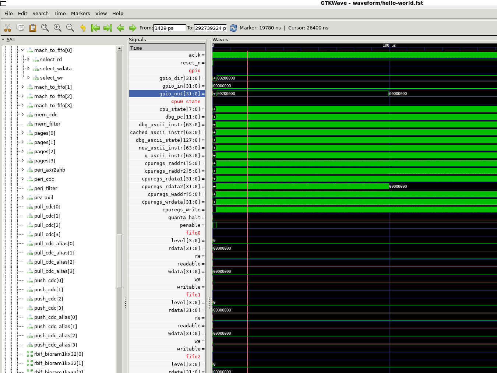
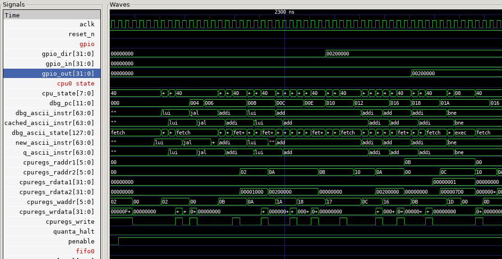

# bio-sim

A Verilator harness for the `bio_bdma` block. The host CPU is not modelled;
everything it would do (load code, poke control registers, start cores) is
reduced to APB transactions on the block's slave ports, driven from C++. The
RTL is used unmodified and built with `+define+SIM`.

## Build & run with containers

The instructions here default to using `podman` but they *should* work identically with
`docker`. `podman` is preferred here as nothing in this repo requires root privileges.

Build the container locally: `podman build -t bio-sim .`

**or**

Install the container:
  - from GHCR: `podman pull ghcr.io/baochip/bio-sim:latest`
  - from Baochip self-hosted: `curl -fsSL https://baochip.com/cdn/bio-sim-latest-x86_64.tar.gz | podman load`

Run the container: `./container-run configs/smoke.json`

- `--rebuild` will rebuild the container
- `--port` defines the port for connecting to clients

## Build & run locally - requires a compatible local Verilator install

```bash
make build                     # fetches json.hpp, runs verilator, compiles
make run CONFIG=configs/smoke.json
# or:
./simulate configs/smoke.json
```

`make build` depends on the single-header `nlohmann/json` into `sim/json.hpp`
(one-time, needs network). If the build host is offline, fetch it manually:
```bash
curl -fsSL https://raw.githubusercontent.com/nlohmann/json/v3.11.3/single_include/nlohmann/json.hpp -o sim/json.hpp
```

## Directory layout

```
bio-sim/
├── rtl/                  # bio-bdma RTL tree, taken from baochip-1x repo
│   ├── bio_bdma.sv
│   ├── bio_bdma_wrapper.sv   # <-- DUT (flattened Verilog ports)
│   ├── picorv32.v ...
│   └── lib/
│       ├── template.sv   # Various libs and configs
│       └── ...
├── sim/
│   └── sim_main.cpp      # the harness (clocks, APB transactor, loader, trace)
├── configs/
│   ├── smoke.jsonc       # no firmware; just the cfginfo self-test
│   └── hello-world.jsonc # example of toggle-a-pin
├── rtl.f                 # Verilator file list
├── Makefile
├── Dockerfile
├── simulate              # Local build & run (not containerized)
├── container-run         # Runs the simulation from a container
├── clients/              # Simulation clients (real-time interaction with simulator)
├── gtkw/                 # GTKW "views"
│   └── bio.gtkw          # A starter view
├── waveform/             # Simulation output directory for `.fst` files
├── sw/
│   ├── build.zig         # Script for building BIO binaries from C code
│   ├── clang2rustasm.py  # Script that creates Rust assembly and patches BIO erratum
│   ├── include/          # Header files with starter libraries
│   │   ├── bio.h         # This is the only .h file you must include in every program
│   │   └── ...
│   ├── blink/
│   │   ├── blink.bin     # Generated artifact, only available after running the build command
│   │   ├── blink.rs      # A Rust macro suitable for including in Xous builds
│   │   └── main.c        # The C source for the `blink` demo
│   └── ...
├── docs/                 # Documentation-related files
└── README.md
```

The containerized version contains a pre-build of the BIO model as an
executable.

## Smoke Test

`configs/smoke.json` runs no firmware. After reset the harness reads
`sfr_cfginfo` at offset `0x04` over the main APB port and checks it equals
`0x10000408` (the register hardwires `{16'd4096, 8'd4, 8'd8}`). A `PASS`
confirms that the build resolved, the clocking/reset are sane, and the APB transactor
completes a real transaction.

Example of successful smoke test run:

```
./container-run configs/smoke.jsonc
>> reusing image 'bio-sim'  (use --rebuild after editing rtl/ or sim/)
[trace] writing waveform/trace.fst
[cfg] fclk=700.000 MHz  pclk=fclk/16 (43.750 MHz)
Addressing configuration for axil_crossbar_addr instance TOP.bio_bdma_wrapper.bio_bdma.axil_demux.axil_crossbar_wr_inst.s_ifaces[0].addr_inst
 0 ( 0): 40000000 / 29 -- 40000000-5fffffff
 1 ( 0): 60000000 / 29 -- 60000000-7fffffff
Addressing configuration for axil_crossbar_addr instance TOP.bio_bdma_wrapper.bio_bdma.axil_demux.axil_crossbar_rd_inst.s_ifaces[0].addr_inst
 0 ( 0): 40000000 / 29 -- 40000000-5fffffff
 1 ( 0): 60000000 / 29 -- 60000000-7fffffff
[selftest] sfr_cfginfo @0x04 = 0x10000408 (expect 0x10000408) -> PASS
[run] up to 0 cycles
[done] sim_time = 902496 ps  (0 cycles)
```

## Hello World

### Build the `blink` demo

#### Prerequisites

The C build system relies on Zig. You can get this via Python's `pip`, requiring Python >= 3.9:

`python3 -m pip install ziglang`

#### Building

Change to the `sw` directory, and run the build script:

```
cd sw
python3 -m ziglang build "-Dmodule=blink"
```

Example output:

```
Label mapping:
  _start               -> 20: (line 0)
  main                 -> 21: (line 6)
  .LBB1_1              -> 22: (line 20)
  .LBB1_3              -> 23: (line 29)

Wrote blink\blink.rs
  input:  zig-out\blink.s
  fn:     blink_bio_code()
  labels: BM_BLINK_BIO_START / BM_BLINK_BIO_END
  instructions: 21
  functions found: 2 (_start, main)
  binary: blink\blink.bin (44 bytes / 11 words)
```

#### Simulating

Change back to the root directory, and run the simulation command:

`./container-run configs/hello-world.jsonc`

Example output:

```
>> reusing image 'bio-sim'  (use --rebuild after editing rtl/ or sim/)
[run] [##############################] 100%  100000/100000 cyc  129856 cyc/s  ETA 0s
[trace] writing waveform/hello-world.fst
[cfg] fclk=350.000 MHz  pclk=fclk/8 (43.750 MHz)
Addressing configuration for axil_crossbar_addr instance TOP.bio_bdma_wrapper.bio_bdma.axil_demux.axil_crossbar_wr_inst.s_ifaces[0].addr_inst
 0 ( 0): 40000000 / 29 -- 40000000-5fffffff
 1 ( 0): 60000000 / 29 -- 60000000-7fffffff
Addressing configuration for axil_crossbar_addr instance TOP.bio_bdma_wrapper.bio_bdma.axil_demux.axil_crossbar_rd_inst.s_ifaces[0].addr_inst
 0 ( 0): 40000000 / 29 -- 40000000-5fffffff
 1 ( 0): 60000000 / 29 -- 60000000-7fffffff
[selftest] sfr_cfginfo @0x04 = 0x10000408 (expect 0x10000408) -> PASS
[mon] watching gpio_out bit 21
[mon] watching gpio_dir bit 21
[mon] watching irq
[load] sw/blink/blink.bin -> core 0 (11 words)
[poke] sfr @0x008 <= 0x00000000
[poke] sfr @0x050 <= 0x00010000
[poke] sfr @0x06c <= 0x00000000
[start] sfr_ctrl @0x00 <= 0x111 (en=0x1 restart=0x1 clkdiv=0x1)
[run] up to 100000 cycles (stop on trap)
[mon] cyc=47 (2317838 ps)  gpio_dir[21]: 0 -> 1
[mon] cyc=59 (2352134 ps)  gpio_out[21]: 0 -> 1
[mon] cyc=33551 (99535566 ps)  gpio_out[21]: 1 -> 0
[mon] cyc=67004 (196698992 ps)  gpio_out[21]: 0 -> 1
[done] sim_time = 292739224 ps  (100000 cycles)
```

This example causes GPIO 21 to wiggle up and down, which you can see with the 0->1, 1->0 transition in the monitor output.

However, you can get full-waveform visibility by installing gtkwave and looking at the `.fst` file output. Check out the [gtkwave](https://github.com/gtkwave/gtkwave) repository for instructions on how to install, and then invoke using the following command:

`gtkwave waveform/hello-world.fst -a gtkw/bio.gtkw &`

This will open up to a screen that looks like this:



Right clicking and dragging will allow you to zoom into the waveform. The simulation is very detailed and contains the exact state of every signal inside the BIO for the duration of the simulation. For example, you can see the exact trace of instructions run by the CPU:



## Serve modes (live socket interaction)

The `serve` command turns the running simulation into a TCP server so an
external program (in any language) can drive inputs and read results over a
socket. The sim is always the **server**; your script is the **client** that
connects. The sim only starts listening once it reaches the `serve` command,
i.e. *after* the preceding `load` / `clock` / `start` setup has run.

There are two modes, chosen by the `"mode"` field. They exist because there
are two fundamentally different things you might want, and they cannot be the
same loop.

### `realtime` (default) - free-running, human-in-the-loop

The sim runs continuously, as fast as the host allows. Inputs you send take
effect at the next cycle boundary, and monitored output transitions stream back
as they happen. This is the mode behind the keyboard/toggle demos.

Because the sim advances on wall-clock time (not on your commands), simulated
time and real time are **not** proportional and the run is **not**
reproducible. That's fine for "does my pin react" interaction, but it is wrong
for anything whose correctness depends on exact cycle timing.

```jsonc
{ "cmd": "serve", "port": 5555, "mode": "realtime",
  "wait_for_client": true,   // block until a client connects before advancing
  "max_cycles": 0,           // 0 = run until stop/Ctrl-C; otherwise stop after N
  "min_dwell": 2000 }        // min cycles an input is held before the next `set`
```

`min_dwell` matters: if a client sends `set`s faster than the sim samples them,
they would collapse into one net change at a single simulated instant. Holding
each input at least `min_dwell` cycles lets the program actually observe each
one. Tune it up toward your program's input-to-reaction latency if fast inputs
get dropped.

| Client → sim | Sim → client |
|---|---|
| `set <pin> <val>` - drive a `gpio_in` bit (paced) | `# bio-sim ready` (banner) |
| `get <signal>` - query a signal | `evt <cycle> <signal> <bit> <val>` (per transition) |
| `stop` - end the session | `val <signal> 0x........` (reply to `get`) |
| | `# bye` (on stop) |

### `driven` - lock-step, deterministic

The sim advances **only** when you tell it to with `run`. You schedule
timestamped input edges with `inject`, advance a controlled number of cycles,
then read results back. Because nothing happens except on your commands, the
result is **identical every run**, regardless of how fast or jittery the socket
is. This is the mode for protocol bring-up (I2S, SPI, UART, …), where stimulus
timing is defined in clock cycles and you need reproducibility.

```jsonc
{ "cmd": "serve", "port": 5555, "mode": "driven",
  "wait_for_client": true }
```

(`max_cycles` / `min_dwell` do not apply here - advancing is explicit.)

| Client → sim | Sim → client |
|---|---|
| `inject <relcycle> <pin> <val>` - schedule a pin edge (no reply) | `# bio-sim ready (driven)` (banner) |
| `run <n>` - advance n cycles | `ran <n>` (after the run completes) |
| `fifo_drain <bank>` - read all available words | `drain <bank> <count>`, then `<count>` × `sample 0x........` |
| `fifo_read <bank> <count>` - read exactly count | (same shape as `drain`) |
| `set <pin> <val>` - input applied on next `run` | `val <signal> 0x........` (reply to `get`) |
| `get <signal>` - query a signal | `# bye` (on stop) |
| `stop` - end the session | |

`relcycle` is relative to the sim's current cycle when the `inject` is received,
so a client typically ships all of a waveform's edges up front, then `run`s
through them in chunks, draining the FIFO between chunks. Unlike `realtime`,
driven mode does **not** stream `evt` transitions - the channel stays a clean
request/response, and the FST captures every transition for waveform viewing.
FIFO ops use the main SFR port only.

### Which to use

- **`realtime`** - interactive demos, "watch my output react to an input I'm
  wiggling", when your test case is better with some non-determinism, etc.
  Wall-clock coupled, not reproducible.
- **`driven`** - automated and protocol-accurate testing where edge timing is
  defined in cycles and results must be deterministic. Primarily useful
  for language-agnostic test vector generation. Examples are in Python but
  the use of a socket allows any language to generate and run the simulator.

### Connecting

The sim listens *inside* the container, so the port must be published to the
host. `container-run` auto-detects the `"port"` from the config and publishes
it; pass `--port N` to override. Confirm the right binary is running by the
banner: `realtime` greets with `# bio-sim ready`, `driven` with
`# bio-sim ready (driven)`.

## AI Usage Notice

This tool was developed with a lot of assistance from Claude Opus 4.8 High
